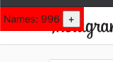
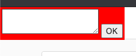
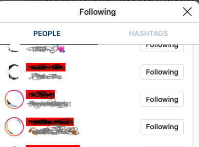

# Instagram helper tool

This is just a start of helper tools for instagram client in browser. 

In current state it just marks people from given list in following window.
So if you obtain list of uses that doesn`t follow you, script marks them for you
and you can unfollow them by regular clicking.

## But why? Why do I need this? There are other scripts...

This script is "ghots injection" and it behave exactly as human (because human launches actions)
. There is no way to recognize there is script. Actually "automatic clicking" is 
not implemented, for now.


# Installation

There are needed two steps for running script.

1. You must somehow inject content of script "ihh.js" into instagram page running in browser. 
Best way to do is to use some javascript autoload plugin. 
Or use [snippets in Chorome](https://developers.google.com/web/tools/chrome-devtools/javascript/snippets).
2. You must modify converting function to match your input data. 

## The callback in constructor
You see, that in very bottom of script `ihh.js` there
is a creation of new instance and there is a callback as parameter of its constructor.
```javascript
var a = new IH((line)=>{
    return line.split(",")[1];
});
```
List of names will be included from textarea later. Script assume that list is text input where
one line of it presents data about one follower. What this function does is to return follower 
name from
that line. In this very case, the line consist of CSV values and in its second column is our
demanded value, so it us pushed to return.

And that is all.

# How to operate?

After running snippet in browser in the left-top viewport corner will appear little red rectangle:


 
Clicking on `+` button opens textarea where you have to put your list.
 

  
Then open your instagram profile and its following tab. Here you can see follower from list
  marked RED

   
Scripts is watching every AJAX response, and if there is reponse 429 it will notify you. It means
that you must wait a little to do the action again. Its little annoying, but you can 
after while continue and reduce large count of followers....

Oh, and script uses localsotrage, so that you do not need to load followers list every time 
you start sctipt (on page reload or tab close). 

Also script hooks on events (not using watch loop) which creates
no extra cpu load.
   